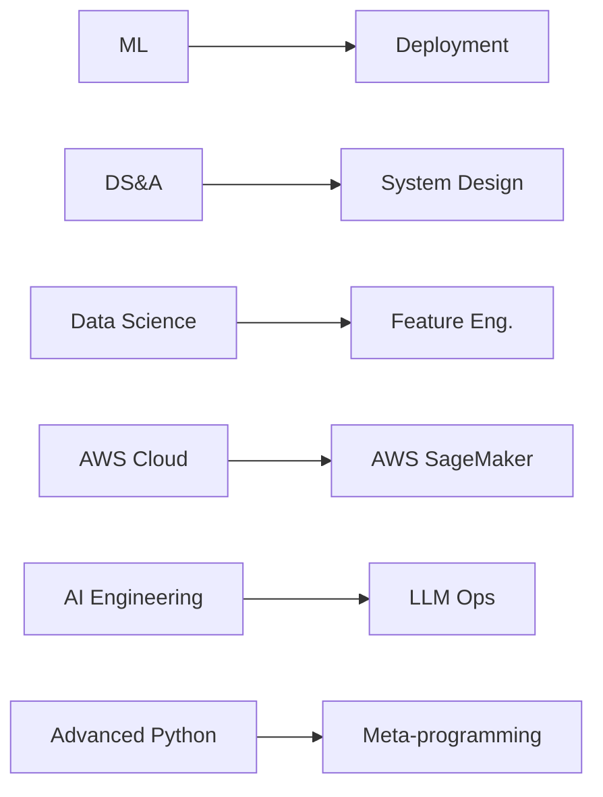

# Raghunath Panda

### AI/ML Engineer • Python Developer • Building Practical AI Systems

---

## 🧑‍💻 About Me

> B.Tech Computer Science & Engineering (**AI/ML**) student at **KIIT University** (2024–2028, CGPA: 7.8)

I'm a **student developer actively building AI/ML systems** — from NLP chatbots to code-intelligence tools — and shipping them with clean Python, Streamlit, and cloud deployment.

My current focus: **practical AI applications**, **MLOps**, and **deployable data products**.

---

## 🎯 Currently Building

- **Mental-wellness assistant** with emotion-aware NLP & mood analytics
- **Code-intelligence platform** for code humanization & polyglot conversion
- **Civic-education assistant** to improve voter accessibility
- **Network-recon GUI** wrapping Nmap for analysts

---

## 🛠️ Technical Skills

#### Programming Languages

#### AI / ML / Data Science

#### Development

#### Cloud / DevOps / Tools

#### Computer Science

---

## 📚 Currently Learning

**Topics:** Machine Learning · Data Structures & Algorithms · Data Science · AWS Cloud · AI Engineering · Real-world AI Application Development · Advanced Python · AI Systems & Practical Deployment

---

## 🚀 Featured Projects

<table>
<tr>
<td width="50%" valign="top">

### 🧠 Mental Wellness Buddy

AI-powered mental wellness assistant (Python + Streamlit) featuring emotion-aware conversations, daily mood tracking, a wellness dashboard, and a safety-aware response layer.

</td>
<td width="50%" valign="top">

### 🧰 Code Humanizer

AI-oriented code transformation platform (Python / FastAPI / Streamlit) that makes code more readable, performs C/C++/Java ↔ Python conversion, generates code from natural-language prompts, and runs quality & security (SAST) analysis.

</td>
</tr>
<tr>
<td width="50%" valign="top">

### 🗳️ Election Guide Assistant

Interactive civic-education application (Streamlit + HTML/CSS/JS) that helps users understand the voting process, build a personalized voting plan, track readiness, run quizzes, and explore an election glossary — built for Challenge 2.

</td>
<td width="50%" valign="top">

### 🌐 Nmap GUI

A Tkinter-based graphical interface for Nmap that simplifies network reconnaissance — wrapping scan commands, service/version detection, OS fingerprinting, and port analysis with exportable CSV/HTML reporting.

</td>
</tr>
</table>

---

## 📊 GitHub Analytics

 

 

---

## 🏆 Achievements

<b>🏅 Recognised Accomplishments</b>

 
<ul>
  <li><strong>HackerRank Python Certification</strong> — 5-star achievement</li>
  <li><strong>AWS Academy Graduate – Cloud Architecting</strong></li>
  <li><strong>Deloitte Cyber Job Simulation</strong> — completed</li>
  <li><strong>IBM Data Science Professional Certificate</strong> (Coursera)</li>
  <li><strong>Microsoft Certified: Azure Solutions Architect Expert</strong> (AZ-305)</li>
  <li><strong>GitHub Certified: Agentic AI Developer</strong> (GH-600, Intermediate)</li>
</ul>

---

## 🎓 Certifications & Credentials

<table>
<tr><th>Credential</th><th>Issuing Organization</th></tr>
<tr><td>Microsoft Certified: Azure Solutions Architect Expert</td><td><a href="https://learn.microsoft.com/training/certifications/azure-solutions-architect/">Microsoft</a> — Exam <code>AZ-305</code>: Designing Microsoft Azure Infrastructure Solutions</td></tr>
<tr><td>Microsoft Certified: Agentic AI Business Solutions Architect</td><td><a href="https://learn.microsoft.com/training/certifications/">Microsoft</a> — Exam <code>AB-100</code></td></tr>
<tr><td>GitHub Certified: Agentic AI Developer</td><td><a href="https://github.com/certification">GitHub</a> — Exam <code>GH-600</code>, Intermediate level, 24-month validity</td></tr>
<tr><td>IBM Data Science Professional Certificate</td><td><a href="https://www.coursera.org/professional-certificates/ibm-data-science">Coursera / IBM</a></td></tr>
<tr><td>Meta Data Analyst Professional Certificate</td><td><a href="https://www.coursera.org/professional-certificates/meta-data-analyst">Coursera / Meta</a></td></tr>
<tr><td>AWS Academy Graduate — Cloud Architecting</td><td><a href="https://aws.amazon.com/training/aws-academy/">AWS Academy</a></td></tr>
<tr><td>HackerRank Python Certification</td><td><a href="https://www.hackerrank.com">HackerRank</a> — 5-star achievement</td></tr>
<tr><td>Deloitte Cyber Job Simulation</td><td><a href="https://www2.deloitte.com">Deloitte</a></td></tr>
<tr><td>AICTE B7 Professional Development Certificate</td><td><a href="https://www.aicte-india.org">AICTE</a></td></tr>
</table>

---

## 🤝 Let's Connect

---

